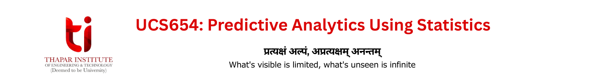

## 🏛️ Course Information

**Course Home Page:** https://www.psrana.com/ucs654-2026

**Lecturers:** Dr. Prashant Singh Rana, Dr. Anjula Mehto, Dr. Suresh Chandra Raikwar  
**Lab Instructor:** Ms. Shabnam Thakur

**Evaluation Components:**
- **60 Marks:** MST and EST- Subject to Institute Policy
- **8 Marks:** 2 Quizzes on LMS 
- **8 Marks:** Assignments
- **8 Marks:** Coursera Guided Projects 
- **8 Marks:** Kaggle Hacks & NumerAI Participation
- **8 Marks:** Woyage AI- Placement Preparation Platform

**Navigation Links:**
- **Kaggle:** https://www.kaggle.com/smarthkaushal
- **Numer AI:** https://numer.ai/onboarding
- **Woyage AI:** https://talent.woyage.ai/

## 💻 Lab Experiments & Guided Projects

### **I. R Programming**
* Basics of R | [Resource](https://github.com/psrana/R-Programming)
* Reference Book: R for Everyone - Advanced Analytics and Graphics | [Drive Link](https://drive.google.com/file/d/1IJKtQ-GkKtrTuENR16rFLzvmTupDD8kJ/view)
* Practice Repository | [View Repo](https://github.com/Smarth2005/R-programming)

### **II. Guided Projects (Coursera)**
* Guided projects are being updated progressively here: [Google Sheet Link](https://docs.google.com/spreadsheets/d/1rLxTP40NubP8g-sTl3qotVp8vV_cexf3iEGKmsyaO0Q/edit?gid=891834841#gid=891834841)
* All the Coursera certifications are progressively added to LinkedIn: [Open LinkedIn](https://www.linkedin.com/in/smarth-kaushal-02a1092b2/details/certifications/)

## 📚 Lecture Resources

### Dr. PS Rana
* [↗️](https://github.com/psrana/Topsis) Topic 1 – Topsis: Multiple Criteria Decision Making  
* [↗️](https://github.com/psrana/Data-Generation-using-Modelling-and-Simulation-for-ML) Topic 2 – Data Generation using Modelling and Simulation for Machine Learning 

### Dr. Anjula Mehto
* [↗️](https://github.com/AnjulaMehto/Sampling) Topic 1 – Sampling Techniques 
* [↗️](https://github.com/AnjulaMehto/Parameter-Estimations-and-Hypothesis_Testing) Topic 2 – Parameter Estimation & Hypothesis Testing  

### Dr. Suresh Raikwar
* [↗️](https://www.scraikwar.com/ucs654) Topic 1 - Advance Mathematics: Probability, PMF, PDF, Random Variables & Distributions (Gaussian, Bernoulli)

### Upcoming Lectures:
- [↗️](https://github.com/AnjulaMehto/Distribution) Distribution 
- [↗️](https://github.com/psrana/Machine-Learning-using-PyCaret) Machine Learning using PyCaret 
- [↗️](https://github.com/psrana/Association-Mining) Association Mining – Apriori 
- [↗️](https://github.com/AnjulaMehto/AssociationMining-ECLAT-) Association Mining – ECLAT  
- [↗️](https://github.com/psrana/Multi-Threading-Using-Python) Multi-Threading using Python 
- [↗️](https://github.com/psrana/Parameter-Optimization-of-SVM) Parameter Optimization 
- [↗️](https://drive.google.com/file/d/1jFPb9EDTonaHanyBNaGjXLOD8_KzW2YJ/view) Nonlinear Modelling  
- [↗️](https://github.com/psrana/Measuring-Data-Similarity-and-Dissimilarity) Measuring Data Similarity & Dissimilarity  
- Ensemble Techniques | *No PPT Available*

## 📂 Course Assignments

-  Assignment 1: TOPSIS
-  Assignment-2: Sampling
-  Assignment-3: Advanced Mathematics
-  Assignment-4: Learning Probability Density Functions Using Data Only
-  Assignment-5: Topsis for Pretrained Models
-  Assignment-6: Data Generation using Modelling and Simulation for Machine Learning
-  Assignment-7: Mashup

## ⚠️ Disclaimer
* This repository is maintained strictly for academic and educational purposes as part of the UCS654 course.
* Course materials, reference links, and certificates are shared only for academic verification and learning.
* Copyright of books, slides, and other reference materials remains with the respective authors and publishers.
